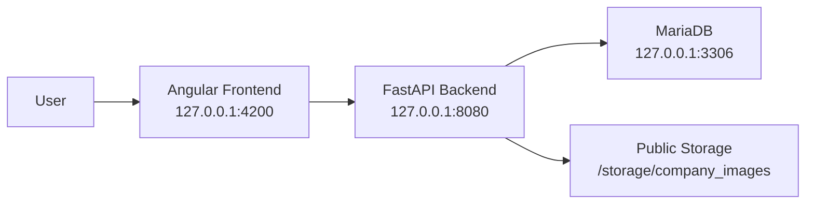

<p align="center">
  
</p>

# This is PlanWise

PlanWise is a full-stack project calculation platform for planning, pricing and evaluating academic and industry projects. It helps teams track customers, faculties, lecturers, expenses, project types and detailed cost structures, then turns all of that into a clear answer: does this project make a profit, and where is the break-even point?

<p align="center">
  
  
  
  
</p>

## Why PlanWise

PlanWise brings the messy parts of project planning into one calm workspace:

- Create and manage projects for different faculties and customers.
- Calculate lecturer costs, project expenses and admin-only additional costs.
- Show detailed cost breakdowns for project decisions.
- Calculate revenue, profit or loss and break-even participants.
- Keep faculty users focused on their own project data.
- Give admins the full view across faculties, users, customers and notifications.
- Export project details and reports as CSV or PDF.

## Tech Stack

| Layer | Technology |
| --- | --- |
| Frontend | Angular, PrimeNG |
| Backend | Python, FastAPI, SQLAlchemy, Pydantic |
| Database | MariaDB |
| Exports | CSV, ReportLab PDF |
| Runtime | Docker Compose |

## Architecture



## Quick Start

Prerequisites:

- Git
- Docker Desktop or Docker Engine

Run the full stack:

```bash
docker compose up --build
```

Open:

- Frontend: http://127.0.0.1:4200
- Backend API: http://127.0.0.1:8080
- MariaDB: `127.0.0.1:3306`

On startup, the backend waits for MariaDB, recreates the schema, seeds mock data and starts Uvicorn.

## Login Data

Admin:

```text
admin@technikum-wien.at
123456
```

Faculty users:

```text
informatik@technikum-wien.at
industrial-engineering@technikum-wien.at
life-science@technikum-wien.at
electronic-engineering@technikum-wien.at
123456
```

## Useful Commands

```bash
docker compose ps
docker compose logs -f backend
docker compose exec backend python -m app.db.fresh_seed
docker compose exec frontend npm run build
```

## Project Layout

```text
backend_fastapi/         FastAPI application
frontend/                Angular application
storage/app/public/      Public assets, including company images
docker/fastapi_backend/  Backend Dockerfile
docker/frontend/         Frontend Dockerfile
docker-compose.yml       Full local runtime
```

## Backend Notes

The backend is implemented with FastAPI and serves the same API surface expected by the Angular frontend. The previous backend implementation has been removed.

Important compatibility points:

- API responses use frontend-friendly camelCase fields.
- Money is stored in cents internally and returned as Euro values where expected.
- Faculty users do not receive admin-only additional cost lists.
- Company images are served through `/storage/company_images/...`.

## Status

PlanWise currently runs end to end in Docker Compose with:

- Angular frontend
- FastAPI backend
- MariaDB database
- Mock data seeded on backend startup
- CSV and PDF exports
- Company image storage
